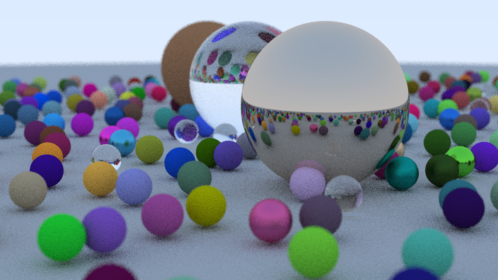

# Overview

A CPU raytracer written in Rust based on the one descrived in [_Ray Tracing in One Weekend_][one_weekend] and [_Ray Tracing: The Next Week_](next_week). It supports multithreading with the Rayon crate, writting to png with the image crate and loading .obj models. 

## Images

Pawn by Poly by Google [CC-BY] (https://creativecommons.org/licenses/by/3.0/) via Poly Pizza (https://poly.pizza/m/fXbCgbsujx4). Teapot from the [Utah model repository](https://users.cs.utah.edu/~dejohnso/models/teapot.html)

## Primitives

Primitives are implemented through a trait called Hittable. The currently implemented primitives are those detailed in the book:

- HittableList
- Sphere
- Parallelogram
- Triangle: Copies the code from parallelogram changing the function that determines if the point is inside the primitive
- ConstantMedium

And the one that I have added:

- Quadric: Can represent a wide range of primitives. Currently only cylinder, sphere and cone

## Profiling

I tried to use cargo flamegraph, but it failed miserably. It gave the following error:

    Error: failed to read dtrace expected output file 'cargo-flamegraph.stacks'

Saing that it ran out of memory. The file 'cargo-flamegraph.stacks' was around 300 Gb.

[one_weekend]: https://raytracing.github.io/books/RayTracingInOneWeekend.html
[next_week]: https://raytracing.github.io/books/RayTracingTheNextWeek.html
